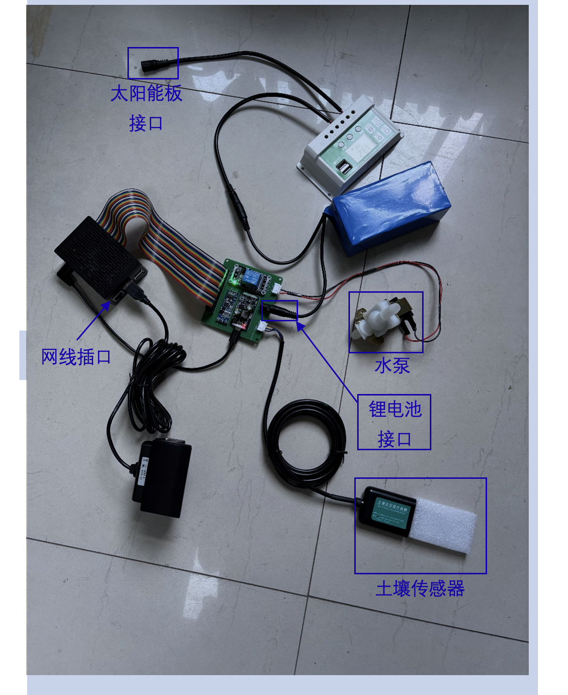

# Automated Irrigation System

A Django-based web application for monitoring and controlling an automated irrigation system with sensor data collection and animal detection capabilities.

## Features

- **Web Dashboard**: Real-time monitoring interface
- **Sensor Data**: Temperature and humidity data collection  
- **Animal Detection**: Record and track animal activity
- **Valve Control**: Remote water valve operation
- **Data Export**: Generate TXT reports
- **Video Streaming**: Live camera feed integration

## Requirements

- Python 3.11+
- MySQL 5.7+
- Django 4.2.17+

## Hardware Connection

For hardware setup, refer to the wiring diagram below:



The diagram shows the connections between:
- Raspberry Pi (main controller)
- Camera module for video monitoring
- Relay module for valve control
- Soil sensor for environmental data
- Network connectivity

## Quick Start

### 1. Clone Repository
```bash
git clone https://github.com/nobody4t/auto-irregation.git
cd auto-irrigation
```

### 2. Install Dependencies
```bash
# Install system dependencies
sudo apt update
sudo apt install mysql-server libmysqlclient-dev python3-pip python3-venv

# Create virtual environment
python3 -m venv venv
source venv/bin/activate

# Install Python packages
pip install -r requirements.txt
```

### 3. Database Setup
```bash
# Start MySQL service
sudo systemctl start mysql

# Create database
sudo mysql -u root -p
```

In MySQL console:
```sql
CREATE DATABASE grass_database;
CREATE USER 'root'@'localhost' IDENTIFIED BY '123456';
GRANT ALL PRIVILEGES ON grass_database.* TO 'root'@'localhost';
FLUSH PRIVILEGES;
EXIT;
```

### 4. Django Setup
```bash
# Run database migrations
python manage.py migrate

# Create superuser (optional)
python manage.py createsuperuser
```

### 5. Start Application
```bash
# Using Django development server
python manage.py runserver 0.0.0.0:8000

# Or use the start script
chmod +x start.sh
./start.sh
```

### 6. Access Application
Open your browser and navigate to:
```
http://localhost:8000
```

## Project Structure

```
auto-irrigate/
├── config/             # Django project settings
├── web/               # Main application
│   ├── models.py      # Database models
│   ├── views.py       # API endpoints
│   ├── soil_sensor.py # Sensor interface
│   ├── valve_control.py # Valve control
│   └── ani_pre.py     # Animal detection
├── templates/         # HTML templates
├── static/           # CSS, JS, images
├── requirements.txt  # Python dependencies
└── manage.py        # Django management
```

## API Endpoints

- `GET /` - Main dashboard
- `GET /getsensordata/` - Retrieve sensor data
- `POST /valvecontrol/` - Control water valve
- `GET /video_stream/` - Camera stream
- `GET /generaltxt/` - Generate data reports

## Database Models

### GrassEnvironment
Stores environmental sensor data:
- `Time` - Timestamp
- `Temperature` - Temperature reading
- `Humidity` - Humidity reading

### AnimalRecord  
Stores animal detection records:
- `Time` - Timestamp
- `Record` - Detection data

## Configuration

### Database Settings
Update `config/settings.py` if needed:
```python
DATABASES = {
    'default': {
        'ENGINE': 'django.db.backends.mysql',
        'NAME': 'grass_database',
        'USER': 'root',
        'PASSWORD': '123456',
        'HOST': 'localhost',
        'PORT': '3306',
    }
}
```

### Time Zone
Default timezone is set to `Asia/Shanghai`. Modify in `settings.py` if needed.

## Testing

### Test Database Connection
```bash
python manage.py shell -c "from django.db import connection; connection.cursor().execute('SELECT 1'); print('Database OK')"
```

### Test API Endpoints
```bash
# Test sensor data
curl http://localhost:8000/getsensordata/

# Test valve control
curl -X POST http://localhost:8000/valvecontrol/ \
  -H "Content-Type: application/json" \
  -d '{"content": {"operate": "open"}}'
```

## Production Deployment

### Security Checklist
- [ ] Change `SECRET_KEY` in settings.py
- [ ] Set `DEBUG = False`
- [ ] Configure proper `ALLOWED_HOSTS`
- [ ] Use strong database passwords
- [ ] Enable CSRF protection

### Systemd Service
Create `/etc/systemd/system/irrigation.service`:
```ini
[Unit]
Description=Auto Irrigation System
After=network.target mysql.service

[Service]
Type=simple
User=pi
WorkingDirectory=/path/to/auto-irrigate
Environment=PATH=/path/to/auto-irrigate/venv/bin
ExecStart=/path/to/auto-irrigate/venv/bin/python manage.py runserver 0.0.0.0:8000
Restart=always

[Install]
WantedBy=multi-user.target
```

Enable and start:
```bash
sudo systemctl daemon-reload
sudo systemctl enable irrigation.service
sudo systemctl start irrigation.service
```

## Troubleshooting

### Common Issues

**Database Connection Error**
```bash
# Check MySQL status
sudo systemctl status mysql
sudo systemctl start mysql
```

**Permission Denied**
```bash
# Fix file permissions
chmod +x start.sh
chmod +x manage.py
```

**Static Files Not Loading**
```bash
python manage.py collectstatic
```

### Logs
```bash
# Application logs
tail -f /var/log/irrigation.log

# System service logs
sudo journalctl -u irrigation.service -f
```

## Development

### Adding New Features
1. Create models in `web/models.py`
2. Run `python manage.py makemigrations`
3. Run `python manage.py migrate`
4. Add views in `web/views.py`
5. Update URLs in `web/urls.py`

### Database Migrations
```bash
# Create migrations
python manage.py makemigrations

# Apply migrations
python manage.py migrate

# View migration status
python manage.py showmigrations
```

